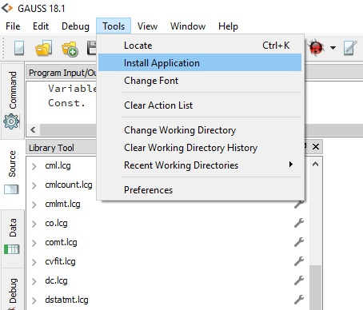

# GAUSS Time Series and Panel data tests
Econometric package for Time Series and Panel Data Methods in unit root, co-integration & causality tests.

The `tspdlib` library is written for GAUSS by Saban Nazlioglu (snazlioglu@pau.edu.tr), Department of International Trade & Finance, Pamukkale University-Türkiye.

## Getting Started
### Prerequisites
The program files require a working copy of **GAUSS 19+**. Many tests can be run on earlier versions with some small revisions and users should contact erica@aptech.com for a modified library for earlier **GAUSS** versions.

### Installing
The GAUSS Time Series and Panel data tests can be easily installed using the **GAUSS Application Installer**, as shown below:

1. Download the zipped folder `tspdlib.zip`.
2. Select **Tools > Install Application** from the main **GAUSS** menu.

3. Follow the installer prompts, making sure to navigate to the downloaded `tspdlib.zip`.
4. Before using the functions created by `tspdlib` you will need to load the newly created `tspdlib` library. This can be done in a number of ways:
  *   Navigate to the library tool view window and click the small wrench located next to the `tspdlib` library. Select `Load Library`.  
  
  *  Enter `library tspdlib` in the program input/output window.
  *  Put the line `library tspdlib;` at the beginning of your program files.

  Note: I have provided the individual files found in `tspdlib.zip` for examination and review. However, installation should always be done using the `tspdlib.zip` folder and the **GAUSS Application Installer**.

### Examples
After installing the library the example files **examples > PDuroot.e** and **examples > TSuroot.e** will be found in your **GAUSS** home directory in the directory **pkgs > tspdlib >examples**. The example uses **GAUSS** datasets included in the **pkgs > tspdlib >examples** directory.

## License
The author makes no performance guarantees. The `tspdlib` is available for public non-commercial use only.

## Author
For any bugs, please send e-mail to Saban Nazlioglu at snazlioglu@pau.edu.tr or Erica Clower at erica@aptech.com.
